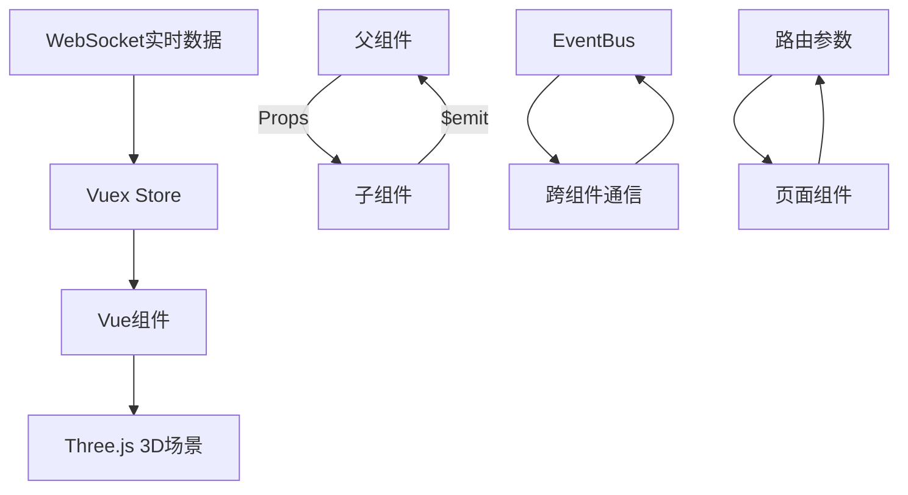

# 数字孪生变电站系统架构分析报告

## 1. 项目概述

本项目是基于Vue.js和Three.js开发的数字孪生变电站监控系统，通过3D可视化技术实现对变电站的实时监控、设备控制和智能分析。系统采用现代化的前端技术栈，实现了高沉浸感的数字孪生体验。

## 2. 技术栈架构

### 2.1 核心技术组合

| 技术类别 | 技术选型 | 版本 | 用途 |
|---------|---------|------|------|
| **前端框架** | Vue.js | 2.6.10 | 主框架，组件化开发 |
| **状态管理** | Vuex | 3.1.0 | 全局状态管理 |
| **路由管理** | Vue Router | 3.0.2 | 页面路由控制 |
| **UI组件库** | Element UI | 2.13.2 | 界面组件库 |
| **3D渲染引擎** | Three.js | ^0.133.1 | 3D图形渲染 |
| **数据可视化** | ECharts | 4.2.1 | 图表展示 |
| **大屏组件** | @jiaminghi/data-view | 2.10.0 | 大屏数据展示 |
| **HTTP客户端** | Axios | ^0.21.1 | API请求 |
| **WebSocket** | 原生WebSocket | - | 实时数据通信 |

### 2.2 3D渲染相关技术

```javascript
// Three.js核心模块
- Three.js ^0.133.1           // 3D渲染引擎
- GLTFLoader                  // GLTF模型加载器
- FBXLoader                   // FBX模型加载器
- DRACOLoader                 // 模型压缩解码
- OrbitControls               // 轨道控制器
- EffectComposer              // 后处理效果合成器
- UnrealBloomPass             // 泛光特效
- OutlinePass                 // 轮廓特效
```

## 3. 项目目录结构

```
src/
├── assets/                   # 静态资源
├── components/               # 公共组件
│   ├── Swiper/              # 轮播组件
│   ├── scroll.vue           # 滚动组件
│   └── video.vue            # 视频播放组件
├── router/                  # 路由配置
│   └── index.js
├── store/                   # Vuex状态管理
│   ├── modules/
│   │   ├── app.js          # 应用状态
│   │   ├── user.js         # 用户状态
│   │   └── permission.js   # 权限管理
│   └── index.js
├── utils/                   # 工具函数
│   ├── ModelLoader.js      # 优化模型加载器
│   ├── RenderThrottler.js  # 渲染节流器
│   └── TextureOptimizer.js # 纹理优化器
├── views/                   # 页面组件
│   └── sunny/
│       ├── Digital Twin/   # 数字孪生主模块
│       │   ├── index.vue   # 主入口组件
│       │   ├── components/ # 业务组件
│       │   │   ├── navigation.vue    # 顶部导航
│       │   │   ├── zsbgm.vue         # 主设备规模
│       │   │   ├── gzsbgm.vue        # 感知设备规模
│       │   │   ├── zbdfh.vue         # 主变电负荷
│       │   │   ├── czt.vue           # 设备操作台
│       │   │   ├── wlsjtj.vue        # 物联事件统计
│       │   │   ├── hjxx.vue          # 环境信息
│       │   │   └── sbxq.vue          # 设备详情
│       │   └── styles/               # 样式文件
│       │       └── animate.css       # 动画效果
│       └── ssdt/                    # 实时动态
└── App.vue                   # 根组件
```

## 4. 组件通信架构

### 4.1 通信方式总览



### 4.2 WebSocket多通道架构

```javascript
// WebSocket连接配置
const wsConfig = {
  control: 'ws://127.0.0.1:9000',    // 设备控制指令
  alarm: 'ws://localhost:9752',       // 告警触发
  ai: 'ws://127.0.0.1:9760',          // AI智能分析
  power: 'ws://127.0.0.1:9762'        // 发电功率预测
};

// 连接管理示例
this.wsControl = new WebSocket(wsConfig.control);
this.wsControl.onmessage = (event) => {
  const data = JSON.parse(event.data);
  this.handleControlCommand(data);
};
```

### 4.3 组件事件通信

```javascript
// 父组件向子组件传递数据
<czt
  :equipment-data="equipmentData"
  @pushEquipmentWarning="handleWarning"
  @viewEquipmentDetail="showEquipmentDetail"
  @realTimeMonitor="toggleRealTimeMonitor"
/>

// 子组件触发父组件方法
methods: {
  pushEquipmentWarning() {
    this.$emit('pushEquipmentWarning', {
      id: this.equipmentId,
      status: this.warningStatus
    });
  }
}
```

## 5. 3D渲染系统实现

### 5.1 核心渲染架构

```javascript
// Three.js场景初始化
export class SceneManager {
  constructor(container) {
    this.scene = new THREE.Scene();
    this.camera = new THREE.PerspectiveCamera(75, width / height, 0.1, 1000);
    this.renderer = new THREE.WebGLRenderer({
      antialias: false,
      logarithmicDepthBuffer: true,  // 解决大场景闪烁
      alpha: true
    });

    // HDR环境贴图
    this.initHDREnvironment();

    // 光照系统
    this.initLighting();

    // 轨道控制器
    this.controls = new OrbitControls(this.camera, this.renderer.domElement);
  }
}
```

### 5.2 模型加载优化

```javascript
// 优化的模型加载器
export class OptimizedModelLoader {
  constructor() {
    // DRACO压缩解码器
    this.dracoLoader = new DRACOLoader();
    this.dracoLoader.setDecoderPath('/draco/');

    // 纹理管理器
    this.textureManager = new TextureManager();

    // 加载队列管理
    this.loadingQueue = [];
    this.cache = new Map();
  }

  async loadModel(url, options = {}) {
    // 检查缓存
    if (this.cache.has(url)) {
      return this.cache.get(url);
    }

    // 实例化加载器
    const loader = new GLTFLoader();
    loader.setDRACOLoader(this.dracoLoader);

    // 加载模型
    const gltf = await loader.loadAsync(url);

    // 优化模型
    this.optimizeModel(gltf.scene);

    // 缓存模型
    this.cache.set(url, gltf);

    return gltf;
  }
}
```

### 5.3 后处理特效系统

```javascript
// 后处理效果管理
export class PostProcessingSystem {
  constructor(renderer, scene, camera) {
    this.composer = new EffectComposer(renderer);

    // 添加渲染通道
    const renderPass = new RenderPass(scene, camera);
    this.composer.addPass(renderPass);

    // 泛光效果
    this.bloomPass = new UnrealBloomPass(
      new THREE.Vector2(window.innerWidth, window.innerHeight),
      1.5, 0.4, 0.85
    );
    this.composer.addPass(this.bloomPass);

    // 轮廓效果
    this.outlinePass = new OutlinePass(
      new THREE.Vector2(window.innerWidth, window.innerHeight),
      scene, camera
    );
    this.composer.addPass(this.outlinePass);

    // 故障效果
    this.glitchPass = new GlitchPass();
    this.composer.addPass(this.glitchPass);
  }
}
```

## 6. 数据流管理

### 6.1 Vuex状态管理架构

```javascript
// store/modules/app.js
const app = {
  namespaced: true,
  state: {
    deviceList: [],           // 设备列表
    alarmList: [],            // 告警列表
    realTimeData: {},         // 实时数据
    systemStatus: 'running'   // 系统状态
  },

  mutations: {
    SET_DEVICE_LIST(state, devices) {
      state.deviceList = devices;
    },
    UPDATE_DEVICE_STATUS(state, { deviceId, status }) {
      const device = state.deviceList.find(d => d.id === deviceId);
      if (device) {
        device.status = status;
      }
    }
  },

  actions: {
    async fetchDevices({ commit }) {
      const devices = await api.getDevices();
      commit('SET_DEVICE_LIST', devices);
    }
  }
};
```

### 6.2 数据流向图

```
外部数据源 → WebSocket接收 → 数据处理 → Vuex Store → Vue组件更新 → 3D场景渲染
     ↑                                                           ↓
     └─────────────── 用户交互 ←── UI反馈 ←─── 状态变化 ←─────────┘
```

## 7. 性能优化策略

### 7.1 渲染性能优化

```javascript
// 渲染节流器
export class RenderThrottler {
  constructor(targetFPS = 60) {
    this.targetFPS = targetFPS;
    this.frameInterval = 1000 / targetFPS;
    this.lastFrameTime = 0;
  }

  render(renderCallback, currentTime) {
    if (currentTime - this.lastFrameTime >= this.frameInterval) {
      renderCallback();
      this.lastFrameTime = currentTime;
    }
  }
}

// 自适应质量调整
export class AdaptiveQuality {
  constructor() {
    this.fps = 60;
    this.qualityLevel = 'high';
    this.settings = {
      high: { shadowMap: true, pixelRatio: window.devicePixelRatio },
      medium: { shadowMap: true, pixelRatio: 1 },
      low: { shadowMap: false, pixelRatio: 1 }
    };
  }

  adjustQuality(currentFPS) {
    this.fps = currentFPS;

    if (currentFPS < 30) {
      this.setQuality('low');
    } else if (currentFPS < 45) {
      this.setQuality('medium');
    } else {
      this.setQuality('high');
    }
  }
}
```

### 7.2 内存管理

```javascript
// 资源清理管理
export class ResourceManager {
  constructor() {
    this.resources = new Set();
  }

  addResource(resource) {
    this.resources.add(resource);
  }

  disposeAll() {
    this.resources.forEach(resource => {
      if (resource.geometry) resource.geometry.dispose();
      if (resource.material) {
        if (resource.material.map) resource.material.map.dispose();
        if (resource.material.normalMap) resource.material.normalMap.dispose();
        resource.material.dispose();
      }
    });
    this.resources.clear();
  }
}
```

### 7.3 大场景优化

```javascript
// 视锥体剔除
export class FrustumCulling {
  constructor(camera, scene) {
    this.camera = camera;
    this.scene = scene;
    this.frustum = new THREE.Frustum();
    this.cameraMatrix = new THREE.Matrix4();
  }

  cull() {
    this.cameraMatrix.multiplyMatrices(
      this.camera.projectionMatrix,
      this.camera.matrixWorldInverse
    );
    this.frustum.setFromProjectionMatrix(this.cameraMatrix);

    this.scene.traverse((object) => {
      if (object.isMesh) {
        object.visible = this.frustum.intersectsObject(object);
      }
    });
  }
}
```

## 8. 关键功能实现

### 8.1 设备精灵标签系统

```javascript
// 3D文本标签创建
export function CreateSprite(text, position, attachedObject) {
  const canvas = document.createElement('canvas');
  const context = canvas.getContext('2d');

  // 设置画布大小
  canvas.width = 256;
  canvas.height = 64;

  // 绘制文本
  context.fillStyle = 'rgba(0, 0, 0, 0.5)';
  context.fillRect(0, 0, canvas.width, canvas.height);

  context.font = '24px Arial';
  context.fillStyle = 'white';
  context.textAlign = 'center';
  context.fillText(text, canvas.width / 2, canvas.height / 2 + 8);

  // 创建纹理和材质
  const texture = new THREE.CanvasTexture(canvas);
  const spriteMaterial = new THREE.SpriteMaterial({ map: texture });
  const sprite = new THREE.Sprite(spriteMaterial);

  // 设置位置和缩放
  sprite.position.copy(position);
  sprite.scale.set(2, 0.5, 1);

  // 保存引用
  const spriteInfo = {
    attachedObject: attachedObject,
    sprite: sprite
  };

  spriteInfoStorage.push(spriteInfo);
  scene.add(sprite);

  return sprite;
}
```

### 8.2 风机动画系统

```javascript
// 风机旋转动画
export class WindTurbineAnimation {
  constructor() {
    this.turbines = [];
    this.lastUpdateTime = 0;
  }

  addTurbine(turbine) {
    this.turbines.push(turbine);
  }

  update(currentTime) {
    // 每100ms更新一次
    if (currentTime - this.lastUpdateTime > 100) {
      this.turbines.forEach(turbine => {
        if (turbine.rotor && turbine.isRunning) {
          const rotationSpeed = turbine.speed || 0.01;
          turbine.rotor.rotation.x += rotationSpeed;
        }
      });
      this.lastUpdateTime = currentTime;
    }
  }
}
```

### 8.3 故障检测与效果

```javascript
// 故障触发和视觉效果
export class FaultDetection {
  constructor(glitchPass) {
    this.glitchPass = glitchPass;
    this.faultProbability = 0.1;
    this.isFaultActive = false;

    this.initFaultDetection();
  }

  initFaultDetection() {
    // 定期检查故障
    setInterval(() => {
      if (Math.random() < this.faultProbability) {
        this.triggerFault();
      }
    }, 3000);
  }

  triggerFault() {
    if (!this.isFaultActive) {
      this.isFaultActive = true;

      // 触发故障效果
      this.glitchPass.curF = Math.random() * 10;

      // 发送告警
      this.sendAlarm();

      // 200ms后恢复正常
      setTimeout(() => {
        this.glitchPass.curF = 0;
        this.isFaultActive = false;
      }, 200);
    }
  }
}
```

## 9. 系统特色与创新

### 9.1 技术亮点

1. **HDR环境渲染**
   - 使用真实HDR环境贴图
   - 实现PBR材质渲染
   - 支持环境反射和折射

2. **智能性能优化**
   - 自适应质量调整
   - 动态LOD系统
   - 内存使用监控

3. **实时数据驱动**
   - WebSocket多通道通信
   - 毫秒级数据更新
   - 事件驱动的状态同步

4. **特效系统**
   - 后处理泛光效果
   - 动态轮廓高亮
   - 故障艺术效果

### 9.2 用户体验优化

- **流畅的相机动画**: 使用TWEEN.js实现平滑过渡
- **智能UI布局**: 响应式设计，自适应不同屏幕
- **直观的交互反馈**: 悬停效果、点击响应、状态指示
- **沉浸式视觉效果**: 科技感UI设计、霓虹灯效果

## 10. 部署与扩展

### 10.1 构建配置

```javascript
// vue.config.js
module.exports = {
  publicPath: './',
  productionSourceMap: false,

  configureWebpack: {
    performance: {
      maxEntrypointSize: 512000,
      maxAssetSize: 512000
    }
  },

  chainWebpack: config => {
    // 优化Three.js相关模块
    config.module
      .rule('three')
      .test(/\.js$/)
      .include.add(path.resolve(__dirname, 'node_modules/three'))
      .end()
      .use('babel-loader')
      .loader('babel-loader');
  }
};
```

### 10.2 扩展建议

1. **技术升级方向**
   - 升级到Vue 3 + Composition API
   - 引入TypeScript增强类型安全
   - 使用Web Workers处理复杂计算

2. **功能扩展点**
   - 增加AR/VR支持
   - 集成机器学习模型
   - 添加多人协作功能

3. **性能优化空间**
   - 使用WebGPU提升渲染性能
   - 实现服务器端渲染优化
   - 添加CDN资源分发

## 11. 总结

本数字孪生变电站系统通过Vue.js + Three.js的技术组合，成功实现了工业级的3D可视化监控平台。系统具有以下特点：

- **架构清晰**: 模块化设计，职责分离明确
- **性能优异**: 多项优化策略保障流畅运行
- **扩展性强**: 组件化开发便于功能扩展
- **体验优秀**: 流畅的交互和沉浸式视觉效果

该系统为工业数字孪生应用提供了完整的解决方案，具有良好的参考价值和推广意义。